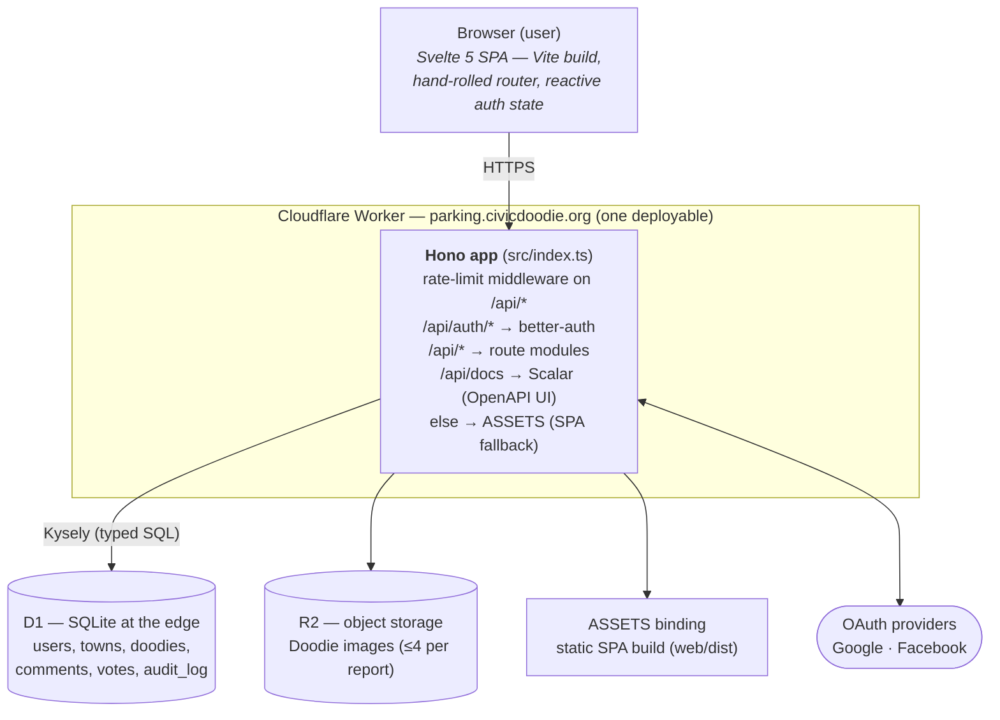
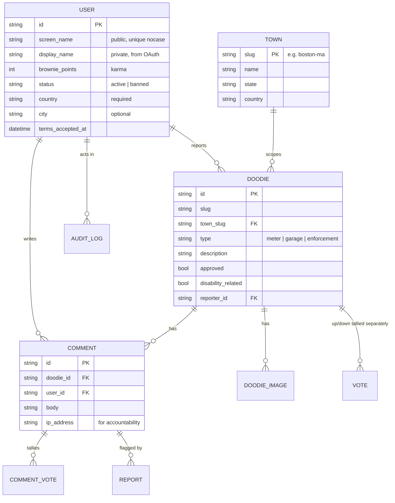
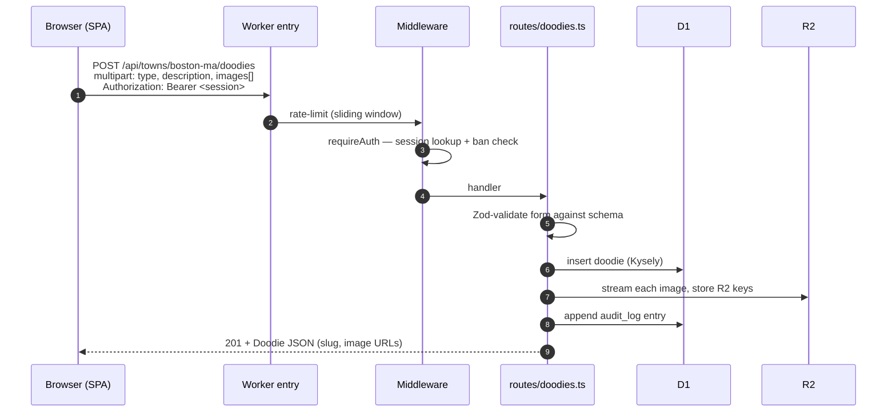
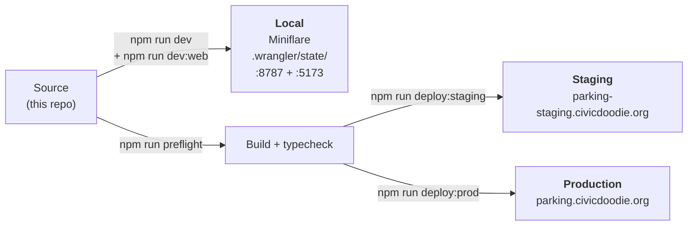

# CivicDoodie Parking — Architecture

> Walkthrough for new contributors. Pairs with [README.md](../README.md) (product spec) and [DEVELOP.md](../DEVELOP.md) (daily commands).

## 1. The one-liner

A **crowdsourced parking-issue tracker**, scoped by municipality ("town"). Users sign in, file **Doodies** (meter / garage / enforcement reports) with photos, then comment + vote. Admins moderate. Everything ships on **Cloudflare's edge**.

## 2. The big picture



**Key insight:** there is **one Worker**. It serves the API *and* the static SPA. No separate frontend host. The `ASSETS` binding with `not_found_handling: "single-page-application"` is what makes deep links like `/profile` work on refresh.

## 3. Data model (D1 / SQLite)



Migrations live in `migrations/` and apply in numeric order — `0001_init` → `0004_screen_name_nocase`.

## 4. Request lifecycle — "user files a Doodie with a photo"



The **same pattern** repeats for every endpoint: middleware → Zod schema → Kysely query → optional R2 → JSON. Get one route, you get all of them.

## 5. Tech stack & why

| Layer | Choice | Why |
|---|---|---|
| Runtime | **Cloudflare Workers** | Global edge, zero ops, generous free tier |
| API framework | **Hono** + `@hono/zod-openapi` | Tiny, Workers-native, schema = docs |
| DB | **D1** (SQLite at the edge) | Same-region as Worker, no connection pool |
| Storage | **R2** | S3-compatible, no egress fees, perfect for images |
| Query builder | **Kysely** + `kysely-d1` | Type-safe, no ORM bloat |
| Auth | **better-auth** | Drop-in OAuth + email/password + bearer tokens |
| Frontend | **Svelte 5** + **Vite** | Small bundle, reactive runes, fast HMR |
| Docs | **Scalar** at `/api/docs` | Auto-generated from Zod schemas |

## 6. Environments & deploy



- `npm run dev` — Worker on `:8787`
- `npm run dev:web` — Vite on `:5173`, proxies `/api` to `:8787`
- `npm run preflight` — build web + backend typecheck (**CI runs the same thing**)
- `wrangler.json` is the local config; `wrangler.deploy.json` is what ships to staging/prod

## 7. What to know before your first PR

1. **OpenAPI is the source of truth.** New route → add its declaration in `src/openapi-routes.ts` and its Zod schema in `src/schemas.ts`. The Scalar UI updates automatically.
2. **Always go through middleware.** `requireAuth` for any user action; `requireAdmin` (which returns **404**, not 403) for moderation so admin endpoints don't leak.
3. **`"user"` is a SQL reserved word** — quote it in D1 queries.
4. **Local D1 is a real SQLite file** in `.wrangler/state/v3/d1/`. Reset with `rm -rf .wrangler/state && npm run migrate:local`.
5. **Run `npm run preflight` before pushing.** Same checks as CI. Green here = green there.

## Appendix — Mermaid quick reference

Any fenced block tagged `mermaid` renders inline on GitHub:

````markdown
```mermaid
flowchart LR
  A[Start] --> B{Decision}
  B -->|yes| C[Do thing]
  B -->|no|  D[Skip]
```
````

Common diagram types used above:

| Type | When to use |
|---|---|
| `flowchart` | Boxes-and-arrows architecture, build pipelines |
| `sequenceDiagram` | Request flows, time-ordered interactions |
| `erDiagram` | Database schemas, entity relationships |
| `stateDiagram-v2` | Lifecycles (e.g. a Doodie: draft → approved → censored) |
| `gantt` | Timelines, release planning |

Live editor: <https://mermaid.live>. Docs: <https://mermaid.js.org>.
